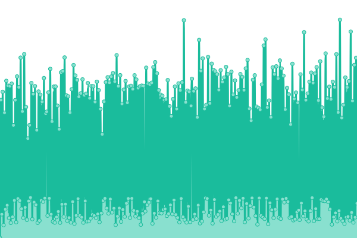

# [📈 Live Status](https://CoopPlayzz.github.io/Webstatus-electronicbrands): <!--live status--> **🟨 Degraded performance**

This repository contains the open-source uptime monitor and status page for [Coop](coopos.github.io/CoopOS), powered by [Upptime](https://github.com/upptime/upptime).

With [Upptime](https://upptime.js.org), you can get your own unlimited and free uptime monitor and status page, powered entirely by a GitHub repository. We use [Issues](https://github.com/CoopPlayzz/Webstatus-electronicbrands/issues) as incident reports, [Actions](https://github.com/CoopPlayzz/Webstatus-electronicbrands/actions) as uptime monitors, and [Pages](https://CoopPlayzz.github.io/Webstatus-electronicbrands) for the status page.

<!--start: status pages-->
<!-- This summary is generated by Upptime (https://github.com/upptime/upptime) -->
<!-- Do not edit this manually, your changes will be overwritten -->
<!-- prettier-ignore -->
| URL | Status | History | Response Time | Uptime |
| --- | ------ | ------- | ------------- | ------ |
|  [Google](https://www.google.com) | 🟩 Up | [google.yml](https://github.com/CoopPlayzz/Webstatus-electronicbrands/commits/HEAD/history/google.yml) | 

 86ms
     
 | 

<a href="https://CoopPlayzz.github.io/Webstatus-electronicbrands/history/google">100.00%</a>
    

|  [Apple](https://apple.com) | 🟩 Up | [apple.yml](https://github.com/CoopPlayzz/Webstatus-electronicbrands/commits/HEAD/history/apple.yml) | 

 245ms
     
 | 

<a href="https://CoopPlayzz.github.io/Webstatus-electronicbrands/history/apple">100.00%</a>
    

|  [Samsung](https://samsung.com) | 🟨 Degraded | [samsung.yml](https://github.com/CoopPlayzz/Webstatus-electronicbrands/commits/HEAD/history/samsung.yml) | 

 1492ms
     
 | 

<a href="https://CoopPlayzz.github.io/Webstatus-electronicbrands/history/samsung">75.65%</a>
    

<!--end: status pages-->

[**Visit our status website →**](https://CoopPlayzz.github.io/Webstatus-electronicbrands)

## 📄 License

- Powered by: [Upptime](https://github.com/upptime/upptime)
- Code: [MIT](./LICENSE) © [Coop](coopos.github.io/CoopOS)
- Data in the `./history` directory: [Open Database License](https://opendatacommons.org/licenses/odbl/1-0/)
